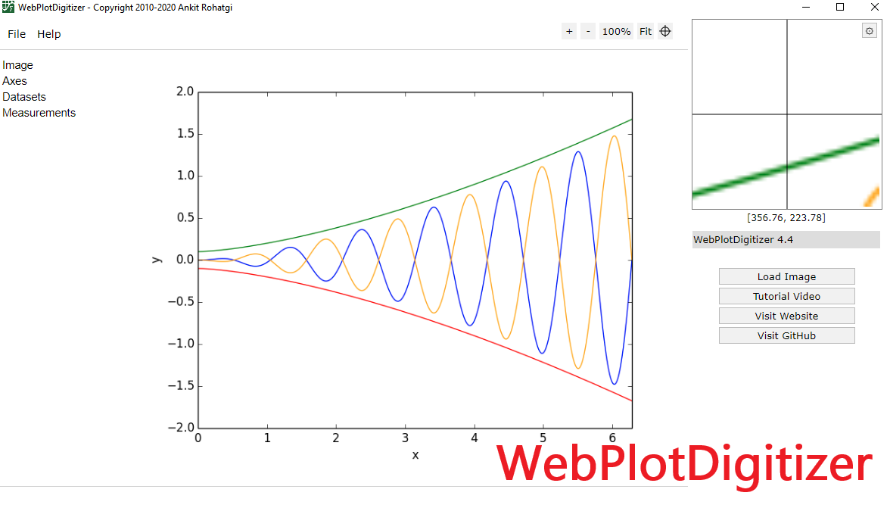
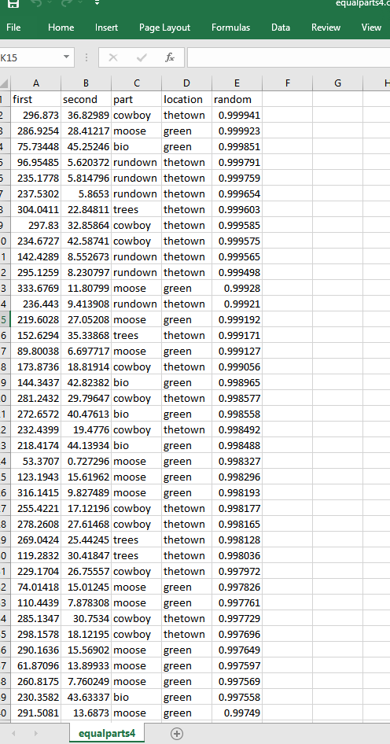

```{r setup, include=FALSE}
knitr::opts_chunk$set(echo = TRUE)
```


```{r packages, eval = FALSE}

## Packages Used
library("ggplot2")
library("dplyr")
library("gridExtra")
library("quantreg")
library("gganimate")
library("animation")
library("transformr")
library("viridis")
library("tidyverse")
library("ggsci")
library("ggpubr")
library("gganimate")
library("magick")
library("ggthemes")

```


## The Goal  

The graphic that is featured on my home-page was visualized with ggplot2.  I had previous experience with ggplot transition slides, from experimenting with them in the BioCore:102 `MooseData` Lab, and wanted to see if I could push the functionality both in practicality and artistic expression.    

Since I knew that I could visually transition between two states of data, I wondered if I could force the data to tell an outright story in that transition.  So much of data and analysis is visualization - it alludes to a picture, but never actually paints a complete one.  It was my goal to flip the script; rather than having data create a picture, I wanted a picture to create data.  

## The Process  

I knew that in order to create a worthwhile graphic, I would need to automate some of the work - creating a picture series by manually entering data points into excel was not on the menu (The final dataset was 16634 observations of 5 variables - it can be found in \\ForcadeBio381\\HW12\\equalparts4.csv).  

To aid in the picture generation, I utilized an open-source applet called WebPlotDigitizer (https://automeris.io/WebPlotDigitizer/).  This applet reverse engineers images into data point locations (x,y - coordinates), which can then be exported into a csv format file.  It is limited in application, so I had to build a local repository of fair-use artistic images that fit the parameters I needed for successful mapping; black and white, bold lines, limited noise, static background.  

  

Once I had the pictures, I began to edit and combine them - adding text and features - along with setting the dimensions exactly the same.  Since the Digitizer exports location data, the dimensions of the dueling pictures must be identical for synchronicity.  When the actual images were built, I partitioned the segments I wanted colored, and ran them through the Digitizer sequentially, as to create an individual dataframe for each color group.  This allowed me to assign a unique group variable (`part`) to each partitioned segment in the csv, which I would then use as the `color` and `fill` argument in ggplot, before combining into a singular file.  For the transition states between the two images, I created and logged a matching variable under `location`.  A final 5th variable `random` was created to randomize the introduction order of the data in the transition graphic.  


> The Final CSV Format is: (x, y, color_group, picture_group, randomgen)

  

In ggplot, the primary workhorse is a R package called 'gganimate' (https://gganimate.com/), which allows (mostly) seamless transition between multiple data positions or groups.  I used the R package 'magick' (https://cran.r-project.org/web/packages/magick/index.html) to export the animated ggplot into a smooth .gif


```{r transcode, eval = FALSE}
equalparts4 <- read.csv("equalparts4.csv")


ggplot(equalparts4, aes(first,second, group=1L, color=part, fill=part))+
  geom_point(show.legend = FALSE, alpha=.6)+
  transition_states(location, transition_length = 1, state_length = 1)+
  ease_aes("quadratic-in-out")+
  theme_void()+
  theme(panel.background = element_rect(fill = "#2D2D2D"))+
  scale_color_brewer()
```  

## The Image  

