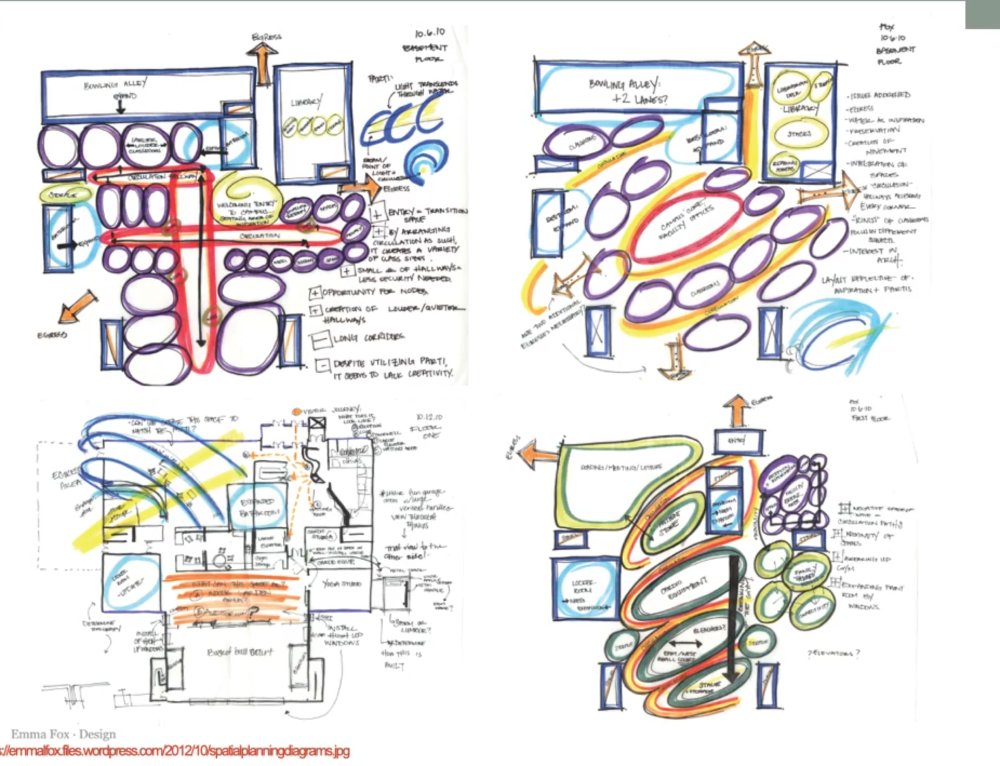

```{r setup, include=FALSE}
knitr::opts_chunk$set(echo = TRUE)
```

```{r packages, eval = FALSE, echo = FALSE}

## Packages Used
library("ggplot2")
library("dplyr")
library("gridExtra")
library("quantreg")
library("gganimate")
library("animation")
library("transformr")
library("viridis")
library("tidyverse")
library("ggsci")
library("ggpubr")
library("gganimate")
library("magick")
library("ggthemes")

```


## Design Process Overview

  

## 1. Client Interview Sample Questions


## 2. Base Map 


  


## 3.  Site Inventory and Analysis


## 4.  Preliminary Site Analysis


  

## 5.  Goals and Objectives

  

## 6.  Program Development

  

## 7.  Concept Diagrams  




## 8.  Schematic Landscape Plans  


  

#### Student Landscape Plans  


  

## 9. Construction Documents


  


