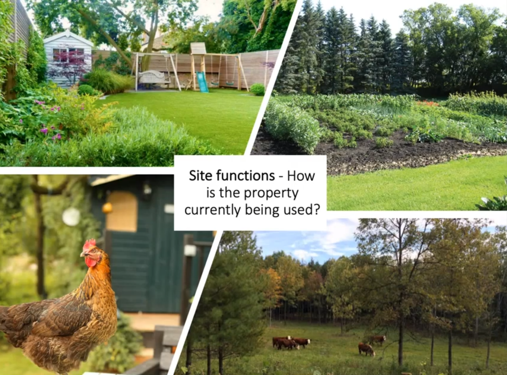

```{r setup, include=FALSE}
knitr::opts_chunk$set(echo = TRUE)
```

```{r packages, eval = FALSE, echo = FALSE}

## Packages Used
library("ggplot2")
library("dplyr")
library("gridExtra")
library("quantreg")
library("gganimate")
library("animation")
library("transformr")
library("viridis")
library("tidyverse")
library("ggsci")
library("ggpubr")
library("gganimate")
library("magick")
library("ggthemes")

```


## Site Analysis Components 


## 811  
  

## Sun Patterns

  

## Soil


## Stormwater  

  

## Topography


## Site Functions

   


## Site History


## Sectors


  


