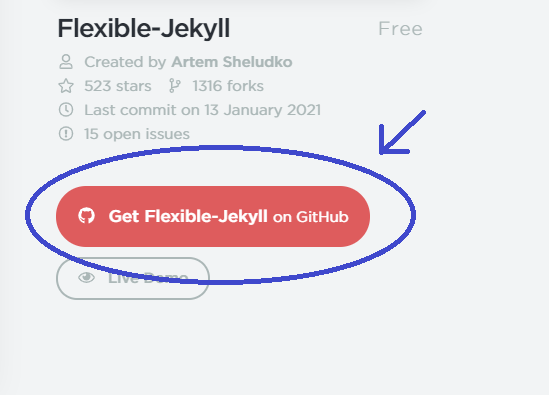

```{r setup, include=FALSE}
knitr::opts_chunk$set(echo = TRUE)
```

## Step 1  
* I used a Jekyll Theme, many free ones can be found here:  

https://jekyllthemes.io/github-pages-themes

> Note: The pages for many of the themes are in html.

## Step 2  
* All the (free) themes have a `Get ____ on Github`. <span style="color:blue">**(blue)**</span>
  + Click this and it will take you to the theme Github page.
  
  
  
## Step 3  
* Once on the theme Github page look for the readme file. `3.1` <span style="color:green">**(green)**</span>: 
  + In the readme, look for the **github** installation section. `3.2` <span style="color:green">**(green)**</span> 
    + Here, the instructions are shown (fork and create a gh-pages branch). `3.2` <span style="color:lightblue">**(light blue)**</span>
    
> *Note* different themes may have different specific parameters (as found in the respective readme)
  
  

  
  
## Step 4 
* After you have read the readme, go back to the repository page. `4.1`
  + This time, click the fork icon in the upper right corner.  This creates a clone of the repo in your github. `4.1` <span style="color:red">**(red)**</span>  
    + If forked successfully, you will see the new "forked" repo on your homepage.  Mine is displayed here in both recent and the front page. `4.2` <span style="color:orange">**(orange)**</span> and <span style="color:lightblue">**(light blue)**</span>
  


  
  
## Step 5  
* Click on the new "forked" repository.  
  + The readme said a new branch called `gh-pages` is needed for this theme:
    1. Click branches. `5.1` <span style="color:red">**(red)**</span>  
    2. Input gh-pages into the drop down prompt. `5.1` <span style="color:purple">**(purple)**</span>  
    3. Create new branch. `5.1` <span style="color:gold">**yellow**</span> 

> Note: Some forks come with gh-pages (or whichever branch) already included.  

  
  
## Step 6  
* On the new `gh-pages` branch, there should be two important files:  
  1. The _config.yml. `6.1` <span style="color:brown">**brown**</span>  
      + This may have important wholesale quick-edit applications, depending on your theme.  
<br />  

  2. The index.html (which is the homepage). `6.1` <span style="color:red">**red**</span>  
      + This executes similarly to the default index.html for the course.  
      + Github reads and launches this as your homepage for the repository.
      + Changes made here will change the homepage.

  
  
## Step 7
* In image `7.1` I have pulled my repo from github into R and am on my own index.html page.  
  + Make sure you are in the correct branch (gh-pages, in this case).
    + `git checkout` in the R Studio terminal will allow you to select the branch.  
      + For example, here it would be `git checkout gh-pages`.  
<br />  
* I have circled a section of my index.html `7.1` <span style="color:green">**green**</span>  
  + The `href="/ForcadeBio381/homework.html"` is a html hyperlink attached to an image `` will change the picture. 
    
> Note: Assets (pictures, gifs, .html) you want to use (and reference/call) should be uploaded into the respository (`git push`)

  


## Step 7: Example: 
* `E.1` is an example of a plain rmarkdown for Homework 3 that is included on my repo.  <span style="color:Orange">**(orange)**</span>  
  + I knit Homework3plain.rmd into Homework3plain.html in R Studio.  
  + I then made sure both folders were in the correct branch (`gh-pages`) and ran a `git push` sequence.  
  <br />  
  
* From here, I just need to change `href="/ForcadeBio381/homework.html"` shown in Step 7 into `href="/ForcadeBio381/Homework3plain.html"` to have Homework3plain.html linked instead.


## Reminder: Change Source!
* Make sure to change the display branch in the repository to the created branch.
  + Go to settings in the upper right of your repository. `R.1` <span style="color:pink">**(pink)**</span>  
  + In settings, scroll down to change `Source` to `gh-pages`. `R.2` <span style="color:lightblue">**(light blue)**</span> 
  
  


